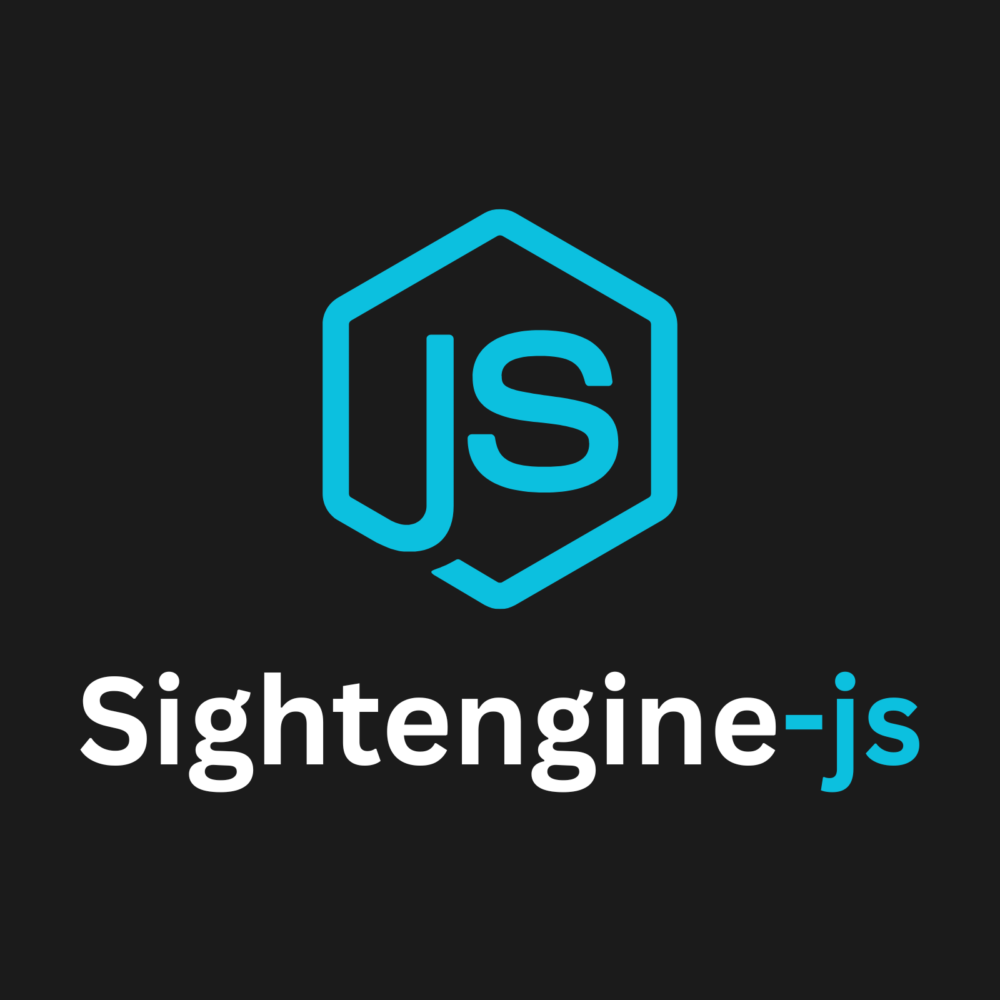

<div align="center">
  <br>
  
  <br>
  <br>

  <h1>Sightenginejs</h1>

  <p>
    <strong>A fully‑typed TypeScript SDK for the SightEngine content‑moderation API, with streaming support, URL/file inputs, threshold presets, and helper utilities.🧬
</strong>
  </p>

  <p>
    <a href="#-features">Features</a> •
    <a href="#-installation">Installation</a> •
    <a href="#-quick-start">Quick Start</a> •
    <a href="#-contributing">Contributing</a>
  </p>

  <p>
    <a href="https://github.com/Silent-Watcher/sightenginejs/blob/master/LICENSE">
      
    </a>
  </p>
</div>

<br>

## 🔥 Features

- ✅ **Fully‑typed** (TypeScript)
- 📡 **Stream** image moderation
- 🌐 **URL** image inputs
- ⚙️ **Threshold presets** + custom thresholds
- 🛠️ Helper utilities: `isNSFW()`, `listFlaggedCategories()`

## 📦 Installation

```bash
npm install sightengine-js
# or
yarn add sightengine-js
```


## 🤝 Contributing

1. Fork the repo
2. Create a feature branch (`git checkout -b feat/...`)
3. Commit with **Commitizen** (`npm run commit`)
4. Push & open a PR against `develop`
5. Tests must pass, coverage ≥ 90%

---

## 📜 License

MIT © [Ali Nazari](https://github.com/Silent-Watcher)


---

<div align="center">
  <p>
    <sub>Built with ❤️ by <a href="https://github.com/Silent-Watcher" target="_blank">Ali Nazari</a>, for developers. Happy encoding! 🎬</sub>
  </p>
  <p>
    <a href="https://github.com/Silent-Watcher/sightenginejs">⭐ Star us on GitHub</a> •
    <a href="https://www.linkedin.com/in/alitte/">🐦 Follow on Linkedin</a>
  </p>
</div>
