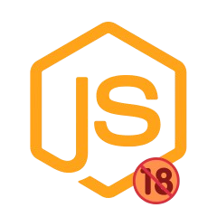
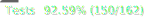

<div align="center">
  <br>
  
  <br>
  <br>

  <h1>Sightenginejs</h1>

  <p>
    <strong>A fully‑typed TypeScript SDK for the SightEngine content‑moderation API, with streaming support, URL/file/base64 inputs, video moderation, feedback endpoint, threshold presets, and helper utilities.🧬
</strong>
  </p>

  <p>
    <a href="#-features">Features</a> •
    <a href="#-installation">Installation</a> •
    <a href="#-quick-start">Quick Start</a> •
    <a href="#-contributing">Contributing</a>
  </p>

  <p>
    <a href="https://github.com/ali-master/llmpeg/blob/master/LICENSE">
      
    </a>
    <a href="#">
      
    </a>
  </p>
</div>

<br>

## 🔥 Features

- ✅ **Fully‑typed** (TypeScript)
- 📦 Supports both **ESM** and **CommonJS**
- 📡 **Stream** and **Buffer**‑based image moderation
- 🌐 **URL**, 📁 **file‑path**, and 🗃️ **base64** image inputs
- 🎥 **Video** moderation: short‑sync & async with callback
- 📝 **Feedback** endpoint for misclassification reporting
- ⚙️ **Threshold presets** + custom thresholds
- 🛠️ Helper utilities: `isNSFW()`, `listFlaggedCategories()`
- 🔄 **Retries**, **timeouts**, and custom HTTP agent support
- 🧪 **Vitest**‑powered tests


## 📦 Installation

```bash
npm install sightenginejs
# or
yarn add sightenginejs
```

## 🚀 Quick Start

```ts
import { SightEngineClient, PRESET_THRESHOLDS, isNSFW } from 'sightengine-sdk';

const client = new SightEngineClient({
  apiUser:   'YOUR_USER',
  apiSecret: 'YOUR_SECRET',
  models: ['nudity-2.1', ...],
  // optional overrides:
  // timeout: 10000,
  // retries: 3,
  // httpAgent: new https.Agent({ keepAlive: true })
});

async function moderateImage() {
  // Buffer-based
  const buffer = fs.readFileSync('path/to/image.jpg');
  const resp = await client.moderate(buffer, 'image.jpg');

  // URL-based
  // const resp = await client.moderateUrl('https://example.com/image.jpg');

  // Check for NSFW content
  if (isNSFW(resp, PRESET_THRESHOLDS.strict)) {
    console.log('⚠️ Content flagged as NSFW:', listFlaggedCategories(resp));
  } else {
    console.log('✅ Content is safe');
  }
}
```

## 📝 API Reference

### `new SightEngineClient(opts: ClientOptions)`

* **`opts.apiUser`** *(string, required)* – Your SightEngine API user.
* **`opts.apiSecret`** *(string, required)* – Your SightEngine API secret.
* **`opts.models`** *(string\[])* – List of models to run.
* **`opts.timeout`** *(number)* – Request timeout in ms (default: 15000).
* **`opts.retries`** *(number)* – Number of retry attempts on 5xx errors (default: 2).
* **`opts.httpAgent`** *(Agent)* – Custom HTTP/HTTPS agent for connection pooling.

Throws if `apiUser` or `apiSecret` are missing or empty.

---

#### Image Moderation Methods

* **`moderate(buffer: Buffer, filename?: string)`**
  Send a `Buffer` or `Uint8Array`.

* **`moderateStream(input: Readable)`** → `Readable`
  Stream‑based input; emits one `ModerationResponse` object.

* **`moderateUrl(url: string)`**
  Moderation by public image URL.

* **`moderateFile(filePath: string)`**
  Moderation by local file path.

* **`moderateBase64(b64: string, filename?: string)`**
  Moderation by base64‑encoded string.

#### Feedback

* **`feedback(model: string, clazz: string, source: string | Buffer | Readable)`**
  Report a misclassification. Posts to `/1.0/feedback.json`.

---

## 🎛️ Thresholds & Helpers

```ts
import { DEFAULT_THRESHOLDS, PRESET_THRESHOLDS, isNSFW, listFlaggedCategories } from 'sightengine-sdk';

const resp = await client.moderate(buffer);
console.log(listFlaggedCategories(resp, PRESET_THRESHOLDS.moderate));
console.log(isNSFW(resp, DEFAULT_THRESHOLDS));
```

* **`DEFAULT_THRESHOLDS`** – sensible defaults.
* **`PRESET_THRESHOLDS`** – `strict`, `moderate`, `lenient` profiles.

---

## 🧪 Testing

```bash
npm run test
# generates coverage reports in coverage/
```

We use **Vitest** and **nock** to stub HTTP calls and ensure high coverage.

---

## 🤝 Contributing

1. Fork the repo
2. Create a feature branch (`git checkout -b feat/...`)
3. Commit with **Commitizen** (`npm run commit`)
4. Push & open a PR against `develop`
5. Tests must pass, coverage ≥ 90%

---

## 📜 License

MIT © [Ali Nazari](https://github.com/Silent-Watcher)


---

<div align="center">
  <p>
    <sub>Built with ❤️ by <a href="https://github.com/Silent-Watcher" target="_blank">Ali Nazari</a>, for developers. Happy encoding! 🎬</sub>
  </p>
  <p>
    <a href="https://github.com/Silent-Watcher/sightenginejs">⭐ Star us on GitHub</a> •
    <a href="https://www.linkedin.com/in/alitte/">🐦 Follow on Linkedin</a>
  </p>
</div>
